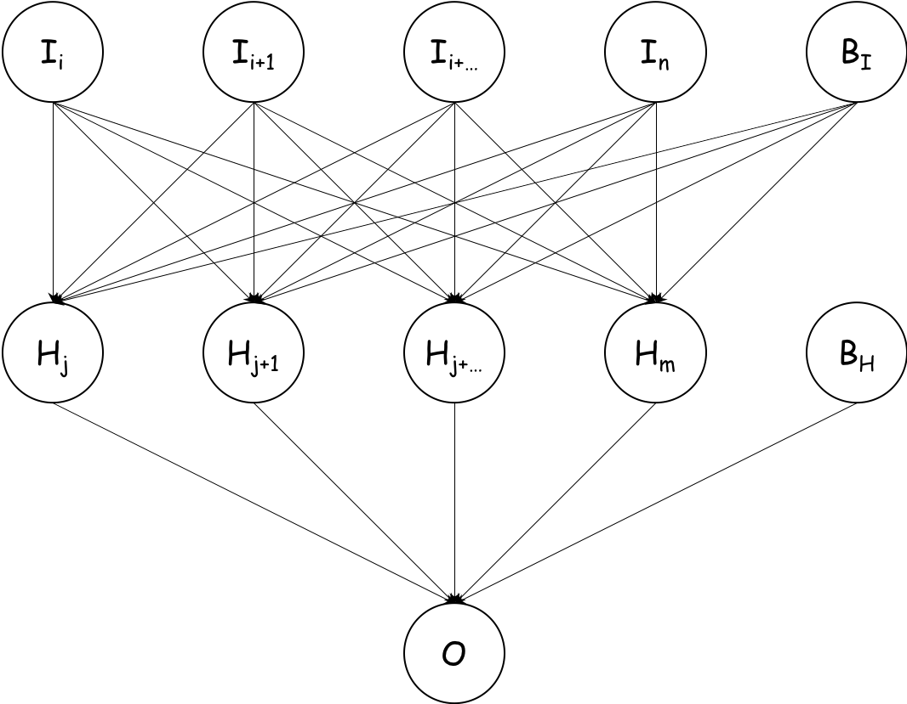
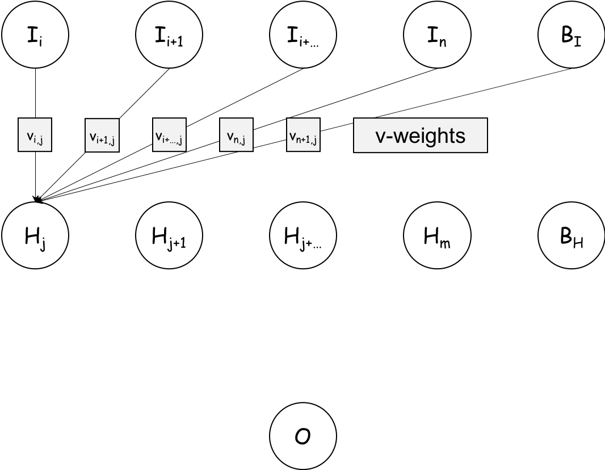
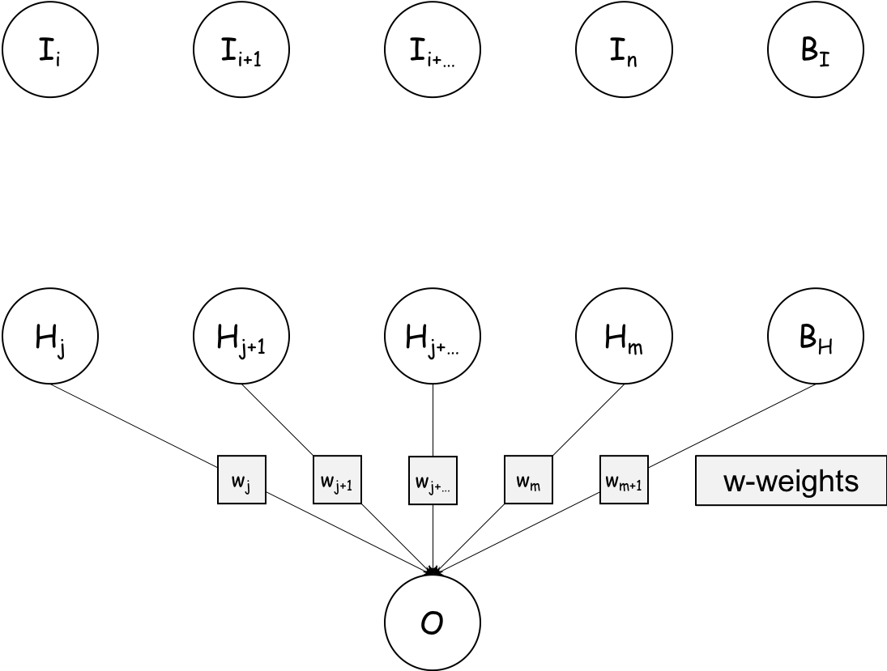
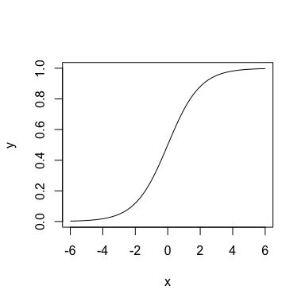
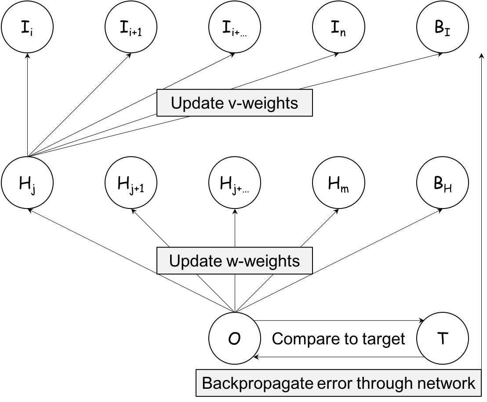

Creating an Artificial Neural Network from Scratch in R
================
Leon Eyrich Jessen

Architecture Illustration
-------------------------

Let's start with looking at a multi layer perceptron with one input layer  with  neurons, one hidden layer  with  neurons. Both the input and the hidden layer have associated bias neurons  and , both of which are always on, i.e. always have the value . Lastly, we have one output neuron . Connected, it looks like this:



This is the simplest form of an artificial neural network (ANN) and represent the workhorse of deep learning. The term deep refers to having multiple hidden layers, but for this example, we will stick the depicted architecture.

Input to Hidden Layer
---------------------

Now, let's look at how the information flows through the network. First, here's an illustration on how the information in the input layer  flows to the first neuron in the hidden layer 



The input to  is the product of the first input neuron and it's associated weight, plus the product of the second input neuron and it's associated weight, etc. i.e.:


If we then let , we get:


So, this is equivalent to the dot product between the input vector  and the weight vector . If we're going to make a ANN from scratch, it looks like we're going to need a function for calculating the dot product between two vectors... Let's create it:

``` r
dot_prod = function(a, b){
  stopifnot( is.numeric(a) & is.numeric(b) & length(a) == length(b) )
  ab = 0
  for( i in seq(from = 1, to = length(a)) ){
    ab = ab + (a[i] * b[i])
  }
  return(ab)
}
dot_prod(a = c(0,1), b = c(1,0))
```

    ## [1] 0

Now we have that in place, let's turn to the information flow from the hidden to the output layer

Hidden to Output Layer
----------------------

Nextly, here's an illustration on how the information in the hidden layer  flows to the output neuron :



Analogue to the information flow from input to hidden layer, the input to  is the product of the first hidden neuron and it's associated weight, plus the product of the second hidden neuron and it's associated weight, etc. i.e.:


If we once again let , we get:


The missing pieces 1
--------------------

Recall, the fully connected network looked like this:


But initially, we only calculated the input to the first hidden neuron . Well, the inputs to all of the following hidden neurons are calculated in precisely the same way. Therefore, foreach hidden neuron, we will need to calculate the dot product between the input layer the associated weight vector:


If we look at this for a moment, it becomes clear, that we can concatenate the  values in a vector ,  is always the same and if we stack the  vectors, we get a matrix. We can therefore condence the above equations to:


I.e. the values for the input layer are calculated as the a series of dot products between the input layer  and each of the corresponding weight vectors  in the matrix  - This is also known as matrix multiplication.

So, it looks like we also need a function for doing matrix multiplication:

``` r
mat_mult = function(A, B){
  stopifnot( is.numeric(A) & is.numeric(B) & ncol(A) == nrow(B) )
  AB = matrix(nrow = nrow(A), ncol = ncol(B))
  for( i in 1:nrow(A) ){
    for( j in 1:ncol(B) ){
      AB[i,j] = dot_prod(A[i,],B[,j])
    }
  }
  return(AB)
}
```

To test it, let's say we have 10 input neurons (features) and 3 hidden neurons:

``` r
(I = matrix(1:10, ncol = 10, nrow = 1))
```

    ##      [,1] [,2] [,3] [,4] [,5] [,6] [,7] [,8] [,9] [,10]
    ## [1,]    1    2    3    4    5    6    7    8    9    10

``` r
(V = matrix(1:30, ncol = 3, nrow = 10))
```

    ##       [,1] [,2] [,3]
    ##  [1,]    1   11   21
    ##  [2,]    2   12   22
    ##  [3,]    3   13   23
    ##  [4,]    4   14   24
    ##  [5,]    5   15   25
    ##  [6,]    6   16   26
    ##  [7,]    7   17   27
    ##  [8,]    8   18   28
    ##  [9,]    9   19   29
    ## [10,]   10   20   30

``` r
mat_mult(I, V)
```

    ##      [,1] [,2] [,3]
    ## [1,]  385  935 1485

To better understand what happened, we can look at these 3 dot products:

``` r
dot_prod(1:10, 1:10)
```

    ## [1] 385

``` r
dot_prod(1:10, 11:20)
```

    ## [1] 935

``` r
dot_prod(1:10, 21:30)
```

    ## [1] 1485

So, each of the values we got, was the dot product of the input (row) vector and the corresponding column vector in the weight matrix.

The missing pieces 2
--------------------

So far all that we have done has been within the realm of linear algebra, but we all know, that the real strength of ANNs lie in the non-linearity, so where does that come into the picture?

Well, we have need an activation function. I.e. as the input arrives at a neuron, it needs to decide whether to propagate the signal (emit 1) or not (emit 0). This is where activation functions come into the picture. For this example, we will use the sigmoid function %20%3D%20%5Cfrac%7B1%7D%7B1+e%5E%7B-x%7D%7D). We can create it like so:

``` r
s = function(x){ 1 / (1 + exp(-x)) }
```

Let's plot it, so we can get a better idea as to what it does:

``` r
x = seq(-6, 6, length.out = 100)
y = s(x)
plot(x, y, type = "l")
```



This means that if the input  to the neuron is very small, it emits 0 and if the input on the other hand is very large, it emits 1. If the input falls inbetween, then a value between 0 and 1 is emitted.

The Feed Forward Algorithm
--------------------------

In summary:

-   Input to hidden layer: 
-   Output from hidden layer: )
-   Input to output layer: 
-   Output from output layer: )

Now we have all the pieces of the puzzle we need to create the feed forward algorithm:

``` r
feed_forward = function(I, V, w){
  stopifnot(is.matrix(I) & is.matrix(V) & is.matrix(w))
  I_out = cbind(I, 1)        # Add bias neuron
  H_in  = mat_mult(I_out, V)
  H_out = cbind(s(H_in), 1)  # Add bias neuron
  O_in  = mat_mult(H_out, w)
  O_out = s(O_in)
  return(O_out)
}
```

Reading just this implementation is not particularly illuminating, however if you have gone over the prior details, I hope this is now clear.

Let's test the function, we'll initialise the weights with random numbers and likewise with the input features:

``` r
set.seed(964631)
(I = matrix(rnorm(10), nrow = 1, ncol = 10)) # 1 x 10
```

    ##            [,1]      [,2]       [,3]       [,4]     [,5]      [,6]
    ## [1,] 0.07858936 0.4803259 -0.7743358 -0.9837618 1.093093 0.3299772
    ##             [,7]       [,8]       [,9]     [,10]
    ## [1,] -0.09815284 -0.8735303 -0.2786501 0.2947034

``` r
(V = matrix(rnorm(33), nrow = 11, ncol = 3)) # (10+1) x 3, adjust rows for bias neuron
```

    ##              [,1]         [,2]       [,3]
    ##  [1,]  0.26153175 -0.416341101 -1.1440324
    ##  [2,] -0.46600656 -1.319431646 -2.1256916
    ##  [3,]  0.44352461 -0.002410466 -1.6000243
    ##  [4,]  1.02346995 -0.638519362 -0.9852892
    ##  [5,] -0.52768189 -0.192791404  1.3777489
    ##  [6,] -0.40472319  0.908526483  0.7517785
    ##  [7,]  0.30019503 -0.789099343 -1.5902067
    ##  [8,]  0.76723325  0.532699227 -0.9186087
    ##  [9,]  0.04219057  0.756073710 -0.9092338
    ## [10,]  1.90301559  0.028583002  0.1569392
    ## [11,] -1.60011511 -1.027341537 -0.1664798

``` r
(w = matrix(rnorm(4), nrow = 4, ncol = 1)) # (3+1) x 1, adjust rows for bias neuron
```

    ##            [,1]
    ## [1,] -0.3505892
    ## [2,] -1.3766658
    ## [3,] -1.4795337
    ## [4,]  0.8555510

``` r
feed_forward(I, V, w)
```

    ##           [,1]
    ## [1,] 0.3015037

That's it - That's all we need to run predictions through an artificial neural network... The next part deals with how we train a neural network to perform 2-class classification

Hope you enjoyed reading so far!

Backpropagation
---------------

More to come...


